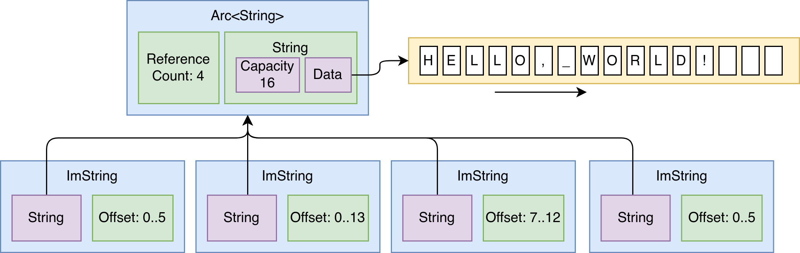

# Immutable Strings

[](https://crates.io/crates/imstr)

Inspired by the [bytes](https://docs.rs/bytes) crate, which offers zero-copy
byte slices, this crate does the same but for strings. It is backed by standard
library string that is stored by smart pointer, and every instance contains a
range into that String. This allows for cheap zero-copy cloning and slicing of
the string. This is especially useful for parsing operations, where a large
string needs to be sliced into a lot of substrings. 

> TL;DR: This crate offers an `ImString`
> type that acts as a `String` (in that it can be modified and used in the same
> way), an `Arc<String>` (in that it is cheap to clone) and an `&str` (in that
> it is cheap to slice) all in one, owned type.



This crate offers a safe API that ensures that every string and every string
slice is UTF-8 encoded. It does not allow slicing of strings within UTF-8
multibyte sequences. It offers `try_*` functions for every operation that can
fail to avoid panics. It also uses extensive unit testing with a full test
coverage to ensure that there is no unsoundness.

## Features

**Efficient Cloning**: The crate's architecture enables low-cost (zero-copy)
clone and slice creation, making it ideal for parsing strings that are widely
shared.

**Efficient Slicing**: The crate's architecture enables low-cost (zero-copy)
slice creation, making it ideal for parsing operations where one large input
string is slices into many smaller strings.

**Copy on Write**: Despite being cheap to clone and slice, it allows for
mutation using copy-on-write. For strings that are not shared, it has an
optimisation to be able to mutate it in-place safely to avoid unnecessary
copying.

**Compatibility**: The API is designed to closely resemble Rust's standard
library [`String`], facilitating smooth integration and being almost a drop-in
replacement.

**Generic over Storage**: The crate is flexible in terms of how the data is
stored.  It allows for using `Arc<String>` for multithreaded applications and
`Rc<String>` for single-threaded use, providing adaptability to different
storage requirements and avoiding the need to pay for atomic operations when
they are not needed.

**Safety**: The crate enforces that all strings and string slices are UTF-8
encoded. Any methods that might violate this are marked as unsafe. All methods
that can fail have a `try_*` variant that will not panic. Use of safe functions
cannot result in unsound behaviour.

## Example

```rust
use imstr::ImString;

// Create new ImString, allocates data.
let mut string = ImString::from("Hello, World");

// Edit: happens in-place (because this is the only reference).
string.push_str("!");

// Clone: this is zero-copy.
let clone = string.clone();

// Slice: this is zero-copy.
let hello = string.slice(0..5);
assert_eq!(hello, "Hello");

// Slice: this is zero-copy.
let world = string.slice(7..12);
assert_eq!(world, "World");

// Here we have to copy only the part that the slice refers to so it can be modified.
let hello = hello + "!";
assert_eq!(hello, "Hello!");
```

## Similar

This is a comparison of this crate to other, similar crates. The comparison is
made on these features:

- **Cheap Clone**: is it a zero-copy operation to clone a string?
- **Cheap Slice** 🍕: is it possibly to cheaply slice a string?
- **Mutable**: is it possible to modify strings?
- **Generic Storage**: is it possible to swap out the storage mechanism?
- **String Compatible**: is it compatible with [`String`]?

Here is the data, with links to the crates for further examination:

| Crate | Cheap Clone| Cheap Slice | Mutable | Generic Storage | String Compatible | Notes |
| --- | --- | --- | --- | --- | --- | --- |
| [`imstr`] | ✅ | ✅ | ✅ | ✅ | ✅ | This crate. |
| [`tendril`] |✅|✅|✅|✅|❌| Complex implementation. API not quite compatible with [`String`], but otherwise closest to what this crate does. |
| [`immut_string`] |✅|❌| 🟡 (no optimization) |❌|❌| Simply a wrapper around `Arc<String>`. |
| [`immutable_string`] |✅|❌|❌|❌|❌| Wrapper around `Arc<str>`. |
| [`arccstr`] |✅|❌|❌|❌|❌| Not UTF-8 (Null-terminated C string). Hand-written `Arc` implementation. |
| [`implicit-clone`] |✅|❌|❌|🟡|✅| Immutable string library. Has `sync` and `unsync` variants. |
| [`semistr`] |❌|❌|❌|❌|❌| Stores short strings inline. |
| [`quetta`] |✅|✅|❌|❌|❌| Wrapper around `Arc<String>` that can be sliced. |
| [`bytesstr`] |✅|🟡|❌|❌|❌| Wrapper around `Bytes`. Cannot be directly sliced. |
| [`fast-str`] |✅|❌|❌|❌|❌| Looks like there could be some unsafety. |
| [`flexstr`] |✅|❌|❌|✅|❌| |
| [`bytestring`] |✅|🟡|❌|❌|❌| Wrapper around `Bytes`. Used by `actix`. Can be indirectly sliced using `slice_ref()`. |
| [`arcstr`] |✅|✅|❌|❌|❌| Can store string literal as `&'static str`. |
| [`cowstr`] |✅|❌|✅|❌|❌| Reimplements `Arc`, custom allocation strategy. |
| [`strck`] |❌|❌|❌|✅|❌| Typechecked string library. |

## License

MIT, see [LICENSE.md](LICENSE.md).

[`imstr`]: https://crates.io/crates/imstr
[`tendril`]: https://crates.io/crates/tendril
[`immut_string`]: https://crates.io/crates/immut_string
[`immutable_string`]: https://crates.io/crates/immutable_string
[`arccstr`]: https://crates.io/crates/arccstr
[`implicit-clone`]: https://crates.io/crates/implicit-clone
[`semistr`]: https://crates.io/crates/semistr
[`quetta`]: https://crates.io/crates/quetta
[`bytesstr`]: https://crates.io/crates/bytesstr
[`fast-str`]: https://crates.io/crates/fast-str
[`flexstr`]: https://crates.io/crates/flexstr
[`bytestring`]: https://crates.io/crates/bytestring
[`arcstr`]: https://crates.io/crates/arcstr
[`cowstr`]: https://crates.io/crates/cowstr
[`strck`]: https://crates.io/crates/strck
[`String`]: https://doc.rust-lang.org/std/string/struct.String.html
