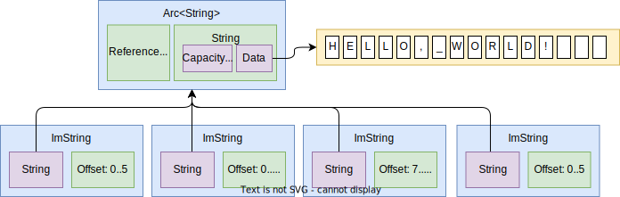

# Immutable Strings

Inspired by the [bytes](https://docs.rs/bytes) crate, which offers zero-copy
byte slices, this crate does the same but for strings. It is backed by standard
library string that is stored by smart pointer, and every instance contains a
range into that String. This allows for cheap zero-copy cloning and slicing of
the string. This is especially useful for parsing operations, where a large
string needs to be sliced into a lot of substrings.

## Features

- **Efficient Cloning**: The crate's architecture enables low-cost (zero-copy)
  clone and slice creation, making it ideal for parsing strings that are widely
  shared.
- **Efficient Slicing**: The crate's architecture enables low-cost
  (zero-copy) slice creation, making it ideal for parsing operations where one
  large input string is slices into many smaller strings.
- **Copy on Write**: Despite being cheap to clone and slice, it allows for
  mutation using copy-on-write. For strings that are not shared, it has an
  optimisation to be able to mutate it in-place safely to avoid unnecessary
  copying.
- **Compatibility**: The API is designed to closely resemble Rust's standard
  library [`String`], facilitating smooth integration and being almost a drop-in
  replacement.
- **Generic over Storage**: The crate is flexible in terms of how the data is stored.
  It allows for using `Arc<String>` for multithreaded applications and
  `Rc<String>` for single-threaded use, providing adaptability to different
  storage requirements and avoiding the need to pay for atomic operations when they
  are not needed.

## Similar

| Crate | Zero-Copy | Slicing | Modify | String Compatible | Notes |
| --- | --- | --- | --- | --- | --- |
| [`tendril`] | Yes | Yes | Yes | No | Complex implementation |
| [`immut_string`] | Yes | No | No |  | Simple |
| [`immutable_string`] | No | No | No | | |
| [`arccstr`] | Yes | No | No | | Not UTF-8 |
| [`implicit-clone`] | Yes | No | No | | |
| [`semistr`] | ? | ? | ? | ? | |
| [`quetta`] | ? | ? | ? | ? | |
| [`bytesstr`] | ? | ? | ? | ? | |
| [`fast-str`] | ? | ? | ? | ? | |
| [`flexstr`] | ? | ? | ? | ? | |
| [`sstable`] | ? | ? | ? | ? | |
| [`bytestring`] | ? | ? | ? | ? | |
| [`arcstr`] | ? | ? | ? | ? | |
| [`cowstr`] | ? | ? | ? | ? | |
| [`strck`] | ? | ? | ? | ? | |

[`tendril`]: https://crates.io/crates/tendril
[`immut_string`]: https://crates.io/crates/immut_string
[`immutable_string`]: https://crates.io/crates/immutable_string
[`arccstr`]: https://crates.io/crates/arccstr
[`implicit-clone`]: https://crates.io/crates/implicit-clone
[`semistr`]: https://crates.io/crates/semistr
[`quetta`]: https://crates.io/crates/quetta
[`bytesstr`]: https://crates.io/crates/bytesstr
[`fast-str`]: https://crates.io/crates/fast-str
[`flexstr`]: https://crates.io/crates/flexstr
[`sstable`]: https://crates.io/crates/sstable
[`bytestring`]: https://crates.io/crates/bytestring
[`arcstr`]: https://crates.io/crates/arcstr
[`cowstr`]: https://crates.io/crates/cowstr
[`strck`]: https://crates.io/crates/strck
[`String`]: https://doc.rust-lang.org/std/string/struct.String.html
